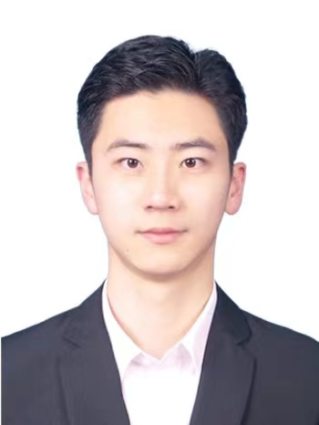
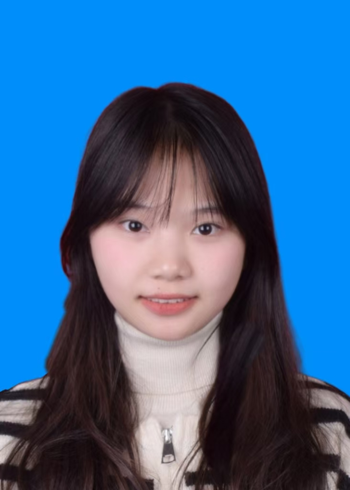

## Current Members

### Principle Investigator
- Shaozhi Li, Associate Professor

### Master Students
- Yuanhao Zhang (张元浩)

    

      
    

    

      He focuses on developing machine-learning-assisted quantum many-body approaches.
    

  

- Zi Yuan (袁姿)

    

      
    

    

      She focuses on studying topological superconductors.
    

  

